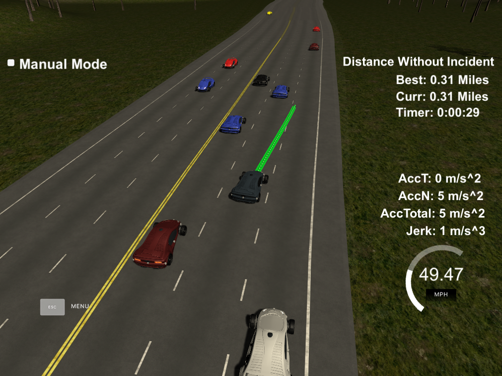

## CarND-Path-Planning-Project

Overview
---
This project is part of the Udacity Self-Driving Car Engineer Nanodegree program Term 3. 

If you are looking for instructions how to build and setup the project environment, please see the [INSTRUCTIONS.md](./INSTRUCTIONS.md) for more details.

### Project Goals
In this project your goal is to safely navigate around a virtual highway with other traffic that is driving +-10 MPH of the 50 MPH speed limit. You will be provided the car's localization and sensor fusion data, there is also a sparse map list of waypoints around the highway. The car should try to go as close as possible to the 50 MPH speed limit, which means passing slower traffic when possible, note that other cars will try to change lanes too. The car should avoid hitting other cars at all cost as well as driving inside of the marked road lanes at all times, unless going from one lane to another. The car should be able to make one complete loop around the 6946m highway. Since the car is trying to go 50 MPH, it should take a little over 5 minutes to complete 1 loop. Also the car should not experience total acceleration over 10 m/s^2 and jerk that is greater than 50 m/s^3.

### Results

### Reflection

#### The Model

The model in its current state is quite simple. The spline library is used in order
to fit a smooth trajectory between the current and the desired location. Starting from the
waypoints of the previous cycle the model tries to add waypoints to minimize jerk and sudden accelerations.

If there is a another car within a 30 m range in front the model is looking to the 
left and right lanes and checks if it is safe to change lanes. If there is no other car 
next to or within 30 m in the other lane the car will perform a lane change.